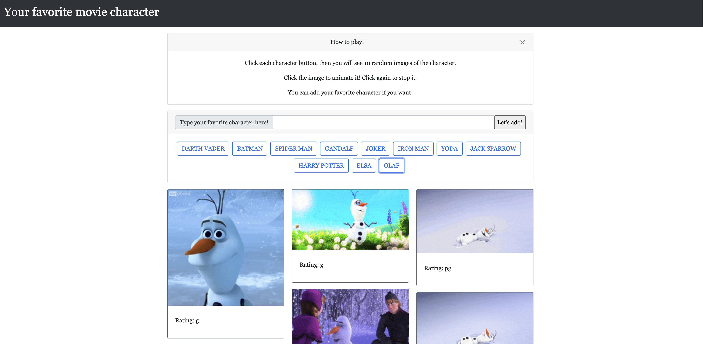

# Giphy AIP
Developed a web-app using HTML, JavaScript, and CSS.

## Rules
- Click each character button, then you will see 10 random images of the character.
- Click the image to animate it! Click again to stop it.
- You can add your favorite character if you want!

## Try it now!
[Go to the app](https://nnjh12.github.io/Giphy-API/)


## Technical approach in each process
1. Create buttons with for loops
    * Empty container first. If not, the buttons will be duplicated.
    * Give the button-value attributes, to use it later when each button is clicked.
1. On click event 1. **Click add button**
    * Make submit button with `<input>` instead of `<button>` to make Enter key work.
    * `event.preventDefault()` to prevent Default behavior of `<input type=submit>` which is refreshing the page.
    * When user click submit button, empty what user typed. `.empty()` is not working. Use `.val("")`.
1. On click event 2. **Click character button** (Call the images from Giphy API with AJAX Call when user click character buttons.)
    * Get the info of what user clicked: `$(this).attr("button-value")`
    * Create the URL including the info of what user clicked.
    * Log the response to see JSON object in my console to pick the needed key.
    * Grab the needed information by using object key and update it into HTML.
    * *In this project, give attributes of still & animate image URL to each images.*
1. On click event 3. **Click image**
    * Use the attributes to change image to still from animate.
    * Update `` to still image URL or animate image URL which were assigned in attributes from previous step.
1. On click event 4. **Click close button**
    * Bootstrap close button. (It is not working without JS)
    * Need to write separate JS as below to make it work.
   ```javascript
   $('.close').on('click',function() {
    $(this).closest('.card').fadeOut()})
    ```
## Small Tips
* There are many buttons with different roles, so use ID or Class name for each button's On click event. 
* Bootstrap card `<div class="card-columns">` make each card stacks without space.
  (Cards can be organized into Masonry-like columns. Cards are ordered from top to bottom and left to right.)
